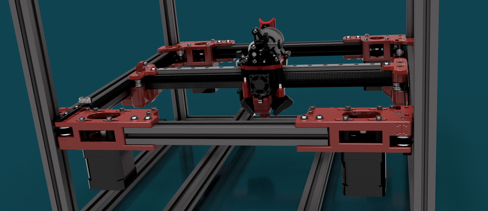

# Fourbie v2

Fourbie v2 is an AWD mod for Voron 2.4 designed to increase the performance of the v2 and unlock more of the potential of this platform. 
While I will not make specific performance claims I can say that in testing, this goal has been met and this mod has led to significant accelleration, top speed and square corner velocity gains on the machines it has been tested on. 
Fourbie v2 is in Beta. 
No documentation is currently available for fourbie v2, so you will need to look right through the CAD for BOM and assembly. This will be remedied in time. See below for a list of changes from Fourbie v1 to v2. But note they are very different mods and should be considered as entirely distinct. They are v1 and v2 because that is the order they were developed. Note that other are taking efforts to mod fourbie v1 and v2 for Trident. I will include these in the repo as mods at the request of the developers. 
Google Drive link below has links to the CAD - they are too big to fit on github here. Please reach out to me TheMrFish on Discord if you have any questions.

https://drive.google.com/drive/u/0/folders/1L2iNjBxE2YqSRG2WW0IpDFqYx307Jbbb

V1 and v2 are very different. Here are some renders of the belt paths:

v1

v2

Main differences:
   * Less idlers, simpler belt path. Less complexity means less failure points. 
   * ~15mm of tensioner travel
   * Tensioners at the front
   * Belts run in front of the rear extrusion. All belts and idlers can now be inspected from within the chamber to ensure they are running true.
   * Easy access to grub screws for syncing motors. 
   * A bit less loss of Y travel
   * Tow versions of AB joints, including one set that is much chonkier with an extra couple of mm of material in the AB drives. These resist twist far more than the standard thickness ones, or stock Voron AB.
   * Lots of minor fixes to alignment and geometry
   * No longer compatible with redoubt parts - v2 is an all in one system with front and rear AB and XY joints designed to be used together.
   * Currently only configured to support CF Tube for the X member. Extrusion or others could be added, not currently supported. 

It's still compatible with the VZ printhead, with the same belt spacing. Refer to the VZ-Prinhead-Printed repo for toolhead information.  
Overall it's a more robust and performant mod than v1. We will continue to distribute the files for v1 as the seprate mods and vasrious configurations this enables still have value - but if you are looking to do the whole system together - while this is a bigger change from stock I would strongly recommend v2 over v1. Any questions should be directed to @TheMrFish on discord, I will happily answer your queries. 

## Options

### 4" lift
These parts are thicker versions of the front and rear AB drives which we have found to be SIGNIFICANTLY stiffer. Back to back testing of performance has not been tested. I suspect they will perform better and may become the standard. Note that you may need to add washers/use longer bolts for your z belt mounting to fit them - I have not specifically looked at the length of this bolt at the time of writing. 

## BOM:
We don't have one yet. But here is some useful info:

### X Gantry:
But at the time of writing you will require a CF tube for the X beam. I designed to be compatible with the Unique Prints CF tubes. These have an M5 hole 7mm from the end. Several users have used generic CF tube off Aliexpress and drilled to specification with success.

### Printhead
See the VZ-Printhead-Printed for details of what you will need to support the VZ printhead. There are some mods to the printhead in the STL's - no further documentation regarding these mods is provided at this time

### Other bits
You will definitely need:
* 2x extra motors for AB. Note that the older voron spec 0.9 degree steppers don't like high speeds, seem to be limited to under 350mm/s @ around 15k which will limit the potential of this machine. You may benefit from a 1.8 degree 2A motor or better.
* Steppers to support the extra motors
* 5mm shafts for the bearing stacks, and all appropriate shims
* 8x Toothed Idlers(including what you may have already) - narrow flanged versions like the ones Mellow sell are recommended. 
* Additional belt - the belt path is SLIGHTLY longer - you will need more belts. 
* 2x 55, 60 or 65mm M5 bolts for the tensioners
* The standoffs/spacers for the vz toolhead - again check vz bom.
* Some way of handling your wiring. We will provide mods for z chain mounts as some users are using these. I run an umbillical straight to the top, and a second umbillical to the top for the motors. Most of you will be running bottom mounted electronics, so mods for the chain will be provided asap. CANbus boards, if they can be made reliably would be a nice option for this toolhead. 
* A hotend of appropriate length to support the VZ toolhead. Mosquito/NF crazy with volcmosq or longer. Again see the VZ-Printhead-Printed repo for more information.

## Important notes

### Syncing motors
All CoreXY AWD setups should have tensioning done:
* With the motors disabled and the grub screws for the pulleys on one of the motors on each belt loosened. 
* The grub screws on that pulley should not engage with the D cut, rather they should engage on the round. 
* Once desired tension has been found and motor screws tightened you should energise your motors before tightening the grub screws.
If you notice a clunk sound when you disable your motors at any point you will need to repeat this process. This is probably best done with the printer at working temperature as belts change lenght over time. See Vez's video on syncing motors on AWD VZ Bot printers for additional info on this. 

### Sensorless homing
This can and has worked with this setup. I will share my thoughts on this, note that I am currently using endstops instead.
I've had issues with reliability and tuning sensorless homing on AWD.
My working theory is as follows:
In a 2wd setup the load from bashing in to the gantry acts on both sides of the belt going in to the motor. 
In AWD there is another whole motor on the belt, taking up some of the load, and the belt run between the two motors is likely not seeing as much of that force as it homes. 
That and if the pulleys on both motors are not perfectly concentric then there is going to be like a wave of loading and unloading tension as it goes through the range of movement. If the motors are not sync'ed then this effect is even worse. 
It can work, and has worked. But I gave up on it and went to microswitches as I was finding it a waste of time. Took less time to wire up some microswitches that I had spent troubleshooting it.

### Concentric pulleys
Make sure you have good pulleys. Having two pulleys with offset concentricity on the same belt WILL cause additional load on your motors and lead to performance issues. Any bent motor shafts will also cause you problems. Quality motor pulleys for XY are recommended.

-- @TheMrFish

## Credit/Attribution
Credit goes to the Voron team for they great work creating the Voron 2.4 https://vorondesign.com/voron2.4
Annex Engineering that inspired some elements of the rear AB drives.  https://github.com/Annex-Engineering/Redoubt
Aive from the Makerbogans discord who's work on an AWD drive system for voron 2.4 defined the belt path for the front AB drives. 
The VZBot team for the VZ printhead - which made developing this mod much faster and also allows for the the use of many more toolhead configurations than we would have provided support for otherwise. https://github.com/VzBoT3D/Vz-Printhead-Printed
Thanks to Vez for giving permission to include the printhead in the CAD. 

