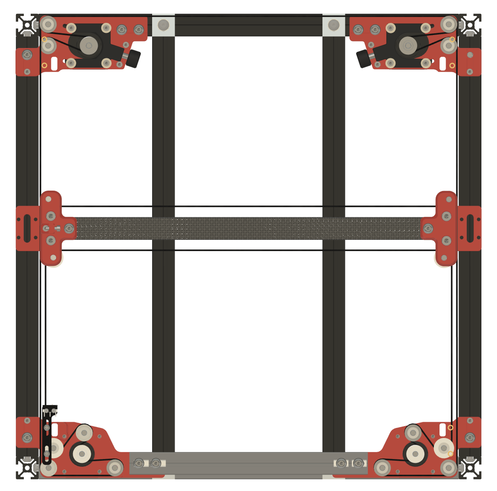
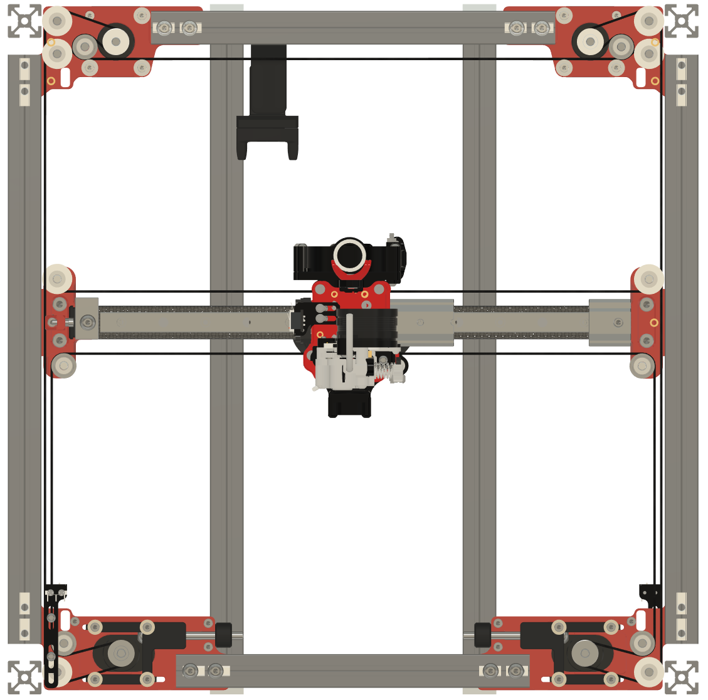

# Fourbie

## Important note
The following information is in regards to the differences between Fourbie v1 and Fourbie v2.
They are both AWD mods for voron 2.4 that use top moutned rails and VZ toolheads. However they are quite different in implementation.
They are labeled v1 and v2 as that is the order they are developed in. v1 is more flexible and compatible if you want to pick and choose which parts of the mod to use, see below. If starting from scratch I strongly recommend you go with v2. v1 is no longer in Active development, however they will continue to be distributed for those who may find them useful in some way.

These are two separate mods, both distributed from this repository in different sub-folders.
Links to the CAD can be found below. Documentation about the specific mods can be found in their specific folders README.MD

CAD can be found here:  https://drive.google.com/drive/u/0/folders/1L2iNjBxE2YqSRG2WW0IpDFqYx307Jbbb

## V2
https://github.com/MakerBogans/Fourbie/tree/main/Fourbie%20v2

## V1
https://github.com/MakerBogans/Fourbie/tree/main/Fourbie%20v1

V1 and v2 are very different. Here are some renders of the belt paths:

## v1

## v2

Main differences:
   * Less idlers, simpler belt path. Less complexity means less failure points. 

   * ~15mm of tensioner travel

   * Tensioners at the front

   * Belts run in front of the rear extrusion. All belts and idlers can now be inspected from within the chamber to ensure they are running true.

   * Easy access to grub screws for syncing motors. 

   * A bit less loss of Y travel

   * Tow versions of AB joints, including one set that is much chonkier with an extra couple of mm of material in the AB drives. These resist twist far more than the standard thickness ones, or stock Voron AB.

   * Lots of minor fixes to alignment and geometry

   * No longer compatible with redoubt parts - v2 is an all in one system with front and rear AB and XY joints designed to be used together.

   * Currently only configured to support CF Tube for the X member. Extrusion or others could be added, not currently supported. 

It's still compatible with the VZ printhead, with the same belt spacing. Refer to the VZ-Prinhead-Printed repo for toolhead information.  
Overall it's a more robust and performant mod than v1. We will continue to distribute the files for v1 as the seprate mods and vasrious configurations this enables still have value - but if you are looking to do the whole system together - while this is a bigger change from stock I would strongly recommend v2 over v1. Any questions should be directed to @TheMrFish on discord, I will happily answer your queries. 

## Credit/Attribution
Credit goes to the Voron team for they great work creating the Voron 2.4 https://vorondesign.com/voron2.4
Annex Engineering that inspired some elements of the rear AB drives.  https://github.com/Annex-Engineering/Redoubt
Aive from the Makerbogans discord who's work on an AWD drive system for voron 2.4 defined the belt path for the front AB drives. 
The VZBot team for the VZ printhead - which made developing this mod much faster and also allows for the the use of many more toolhead configurations than we would have provided support for otherwise. https://github.com/VzBoT3D/Vz-Printhead-Printed
Thanks to Vez for giving permission to include the printhead in the CAD. 

